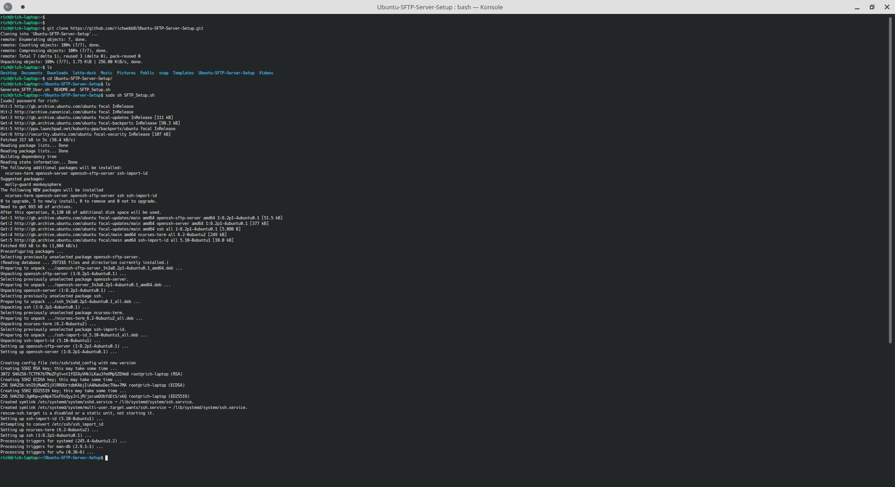
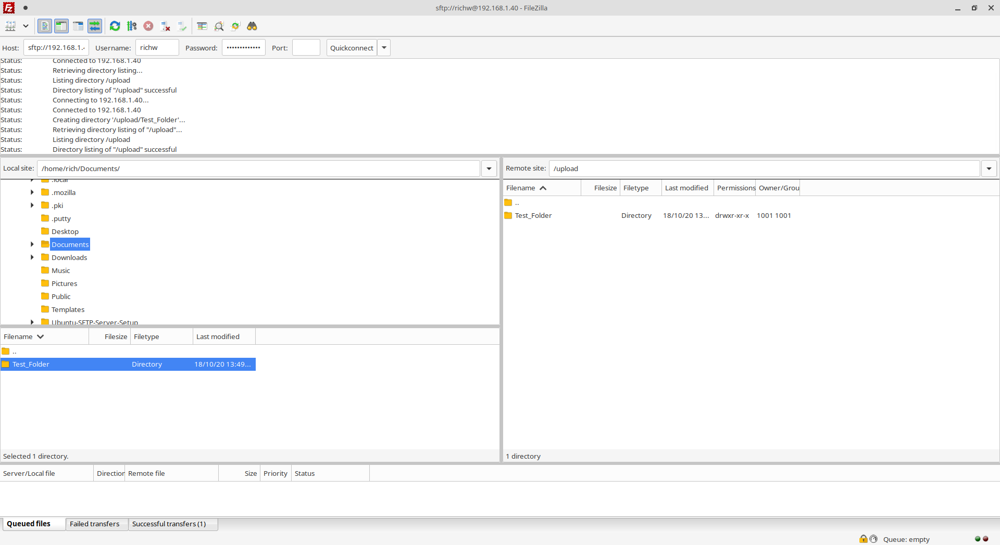

# Ubuntu-SFTP-Server-Setup
Bash scripts to setup an SFTP server and user(s) on Ubuntu - guessing it would also work on other Debian distros.

Contains 2 bash scripts:
- SFTP_Setup.sh
- Generate_SFTP_User.sh

## SFTP_Setup.sh
- Sets up a user group called SFTP_USERS
- Sets up an SFTP server utilising OpenSSH

## Generate_SFTP_User.sh
- Must be called with two user defined arguments 'Username' and 'Password':
```
sudo sh Generate_SFTP_User.sh 'Username' 'Password'
```
- Adds the user to the group SFTP_USERS
- Creates the /data/'Username'/upload directory

## Example
<p align="center">
  
</p>
<p align="center">
  
</p>
<p align="center">
  
</p>
